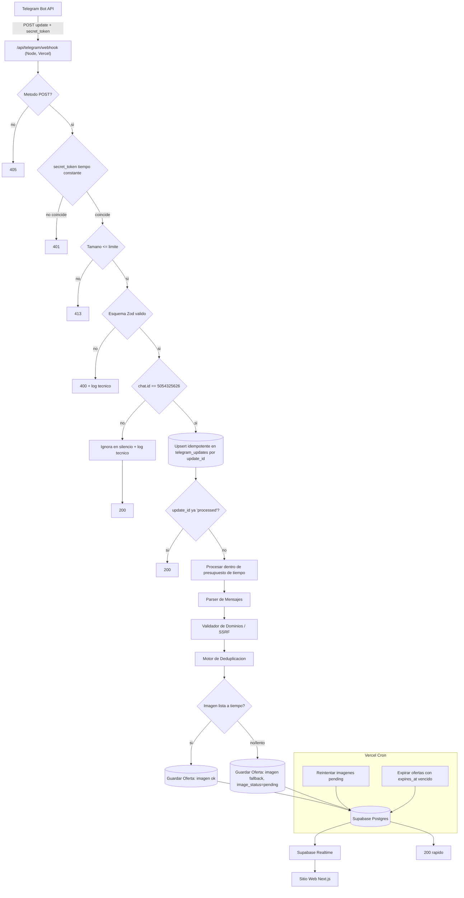

# Documento de Diseño — Ofertas Reales IA

> Este documento es el plano de implementación de la plataforma definida en `requirements.md` (R1–R30). Es un documento de **diseño**: usa fragmentos dirigidos de TypeScript/SQL y diagramas para fijar decisiones, no implementaciones completas. Las referencias a requisitos aparecen como `(R<n>.<m>)`. Ningún secreto aparece como valor literal; los secretos se referencian solo por el nombre de su variable de entorno.

## Visión general

**Propósito.** Construir una plataforma web premium de ofertas en tiempo real para México. Un bot de Telegram recibe mensajes con ofertas en el Chat Autorizado (`chat.id` = 5054325626); el Sistema los valida, parsea, deduplica y almacena en Supabase PostgreSQL; el Sitio Web (Next.js App Router) los muestra y se actualiza casi en vivo mediante Supabase Realtime. Los productos enlazan a Amazon México y Mercado Libre por enlaces de afiliado a través de un redirector propio.

**Orden de prioridad de diseño (rige todo conflicto de diseño):**

```
seguridad > funcionalidad > claridad > accesibilidad > rendimiento > confianza > diseño visual > animación decorativa
```

Cuando dos objetivos compiten, gana el de mayor prioridad. Ejemplos aplicados en este diseño: un secreto del servidor nunca se expone aunque eso simplifique el cliente (seguridad > rendimiento); el contenido principal se renderiza por SSR aunque retrase una animación (claridad/rendimiento > animación); los efectos premium se desactivan en móvil o con `Save-Data` (accesibilidad/rendimiento > diseño visual).

**Principio de honestidad (rector).** El Sistema nunca inventa datos. No se generan reseñas, existencias, contadores de urgencia, cifras de ventas, ahorros agregados, "personas comprando ahora", cuentas regresivas falsas ni insignias de "verificado" sin fundamento. Los campos editoriales que no se pueden derivar del mensaje permanecen vacíos o `needs_review` hasta acción del Administrador (R13.6, R15.4, R21.5). Este principio se materializa en el parser (no rellena campos ausentes, R4.13), en la base de datos (estados explícitos), en el SEO (sin precio estructurado si no se garantiza, R20.6) y en la UI (barra de confianza solo con métricas reales, R13.6).

**Decisiones transversales clave:**

- **Dinero con aritmética decimal exacta.** Toda operación monetaria y de porcentajes usa `decimal.js` (`Decimal`). Nunca aritmética de punto flotante de JS (R4.7). En Postgres los precios son `NUMERIC(12,2)`.
- **Frontera servidor/cliente estricta.** Server Components por defecto; Client Components solo donde hay interacción real (R19.6). Los secretos (`TELEGRAM_BOT_TOKEN`, `TELEGRAM_WEBHOOK_SECRET`, `SUPABASE_SERVICE_ROLE_KEY`) viven solo en el servidor, sin prefijo `NEXT_PUBLIC_`, nunca en el bundle del navegador ni en logs (R8.7, R27.2, R1.16).
- **Confiabilidad del webhook por idempotencia + ack rápido + Cron.** El webhook persiste primero la actualización cruda de forma idempotente, procesa dentro de un presupuesto de tiempo acotado y responde 200 rápido; el trabajo lento o fallido (descarga de imagen) lo reintenta un Cron de Vercel, que también expira ofertas vencidas (R1, R3.8, R9.10).

## Arquitectura

### Topología de ejecución

- **Vercel (serverless).** Aloja la app Next.js: Server Components, Route Handlers (`/api/*`), Server Actions del panel y funciones Cron (`vercel.json`). El Route Handler del webhook corre en runtime Node.js (necesita `crypto.timingSafeEqual`, `sharp` y descargas binarias), no Edge.
- **Supabase (servicios gestionados).** PostgreSQL (datos + RLS), Realtime (propagación de cambios), Storage (imágenes públicas) y Auth (sesión del Administrador). El servidor usa la clave de rol de servicio; el navegador usa solo la clave anónima.
- **Telegram Bot API.** Origen de las actualizaciones vía webhook saliente de Telegram hacia `/api/telegram/webhook`.

### Diagrama de flujo (Telegram → Web)



### Frontera servidor/cliente

| Capa | Ubicación | Acceso a secretos |
|------|-----------|-------------------|
| Webhook, Cron, Route Handlers `/api/*`, Server Actions, Server Components | Servidor (Vercel) | Sí — `SUPABASE_SERVICE_ROLE_KEY`, `TELEGRAM_BOT_TOKEN`, `TELEGRAM_WEBHOOK_SECRET` |
| Client Components, hooks de Realtime, UI interactiva | Navegador | No — solo `NEXT_PUBLIC_*` (URL del sitio, URL/anon key de Supabase, invitación de WhatsApp) |

El cliente de Supabase para el navegador (`@supabase/ssr` `createBrowserClient`) usa exclusivamente la clave anónima y queda sujeto a RLS. El cliente de servicio (`createClient` con la clave de rol de servicio) solo se instancia en módulos marcados `server-only`.

### El problema de confiabilidad: ack rápido vs. trabajo lento (R1.14, R1.15, R3.8, R9.10)

Telegram espera una respuesta 2xx rápida y **reintenta** la entrega si recibe error, timeout o 5xx. Reintentar es seguro porque la idempotencia se ancla en `update_id` (PK de `telegram_updates`) y en la unicidad de `telegram_message_id` dentro del Chat Autorizado.

Estrategia en cuatro tiempos:

1. **Persistir primero, idempotente.** Tras validar método/secreto/tamaño/esquema/chat, se hace `INSERT ... ON CONFLICT (update_id) DO NOTHING` en `telegram_updates` con `processing_status='received'`. Si la fila ya existe con estado terminal (`processed`, `duplicate`, `ignored`, `rejected`) se responde 200 de inmediato sin reprocesar (R1.12). Si existe con `received`/`error`, se reintenta el procesamiento (un reintento de Telegram nunca duplica efectos).
2. **Procesar dentro de un presupuesto de tiempo acotado.** El parseo de texto y la validación de URL son rápidos. La descarga de imagen es la operación lenta: se intenta con un timeout corto (≈2 s). El presupuesto total objetivo es < 3 s para devolver 200 (R1.14).
3. **Degradar con respaldo, no fallar.** Si la imagen no está lista a tiempo o falla, la Oferta se guarda igual con imagen de respaldo y `image_status='pending'`; un Cron la reintenta más tarde (R3.8). Solo un fallo **interno** real (p. ej. la base de datos no responde) produce 5xx para forzar el reintento seguro de Telegram (R1.15).
4. **Cron de mantenimiento.** Un Vercel Cron (cada pocos minutos) reintenta imágenes `pending`/`failed` con backoff y marca `expired` las ofertas `active` cuyo `expires_at` ya transcurrió, propagando el cambio por Realtime (R9.10). Las ofertas sin `expires_at` nunca se expiran por tiempo (R9.9).

## Estructura del proyecto

Disposición App Router (Next.js, TypeScript estricto). Cada carpeta tiene una responsabilidad única.

```
.
├── app/
│   ├── (public)/                  # Grupo de rutas públicas (layout público)
│   │   ├── page.tsx               # / (inicio, SSR)
│   │   ├── ofertas/
│   │   │   ├── page.tsx           # /ofertas (lista, filtros por searchParams)
│   │   │   └── [slug]/page.tsx    # /ofertas/[slug] (detalle)
│   │   ├── amazon/page.tsx
│   │   ├── mercado-libre/page.tsx
│   │   ├── categorias/[slug]/page.tsx
│   │   ├── como-funciona/page.tsx
│   │   ├── transparencia-afiliados/page.tsx
│   │   ├── privacidad/page.tsx
│   │   ├── terminos/page.tsx
│   │   └── contacto/page.tsx
│   ├── (admin)/                   # Grupo admin (layout admin, fuera de nav pública)
│   │   └── admin/
│   │       ├── page.tsx
│   │       ├── ofertas/page.tsx
│   │       ├── ofertas/[id]/page.tsx
│   │       └── telegram/page.tsx
│   ├── api/
│   │   ├── telegram/webhook/route.ts
│   │   ├── offers/route.ts
│   │   ├── offers/[id]/route.ts
│   │   ├── click/[offerId]/route.ts
│   │   ├── admin/offers/route.ts
│   │   ├── admin/telegram/status/route.ts
│   │   └── cron/route.ts          # Reintento de imagenes + expiracion (protegido)
│   ├── opengraph-image/           # next/og dinamico (por oferta)
│   ├── sitemap.ts
│   ├── robots.ts
│   ├── manifest.ts
│   ├── layout.tsx                 # Layout raiz: fuentes, tokens, providers
│   ├── not-found.tsx              # 404
│   └── global-error.tsx           # Error global
├── components/
│   ├── ui/                        # Primitivos shadcn/ui adaptados a tokens
│   ├── offers/                    # OfferCard, OfferGrid, OfferDetail, Filters, SearchCommand...
│   ├── layout/                    # Header, Footer, TrustBar, MobileNav, ThemeToggle...
│   └── admin/                     # AdminTable, AdminOfferEditor, TestMessagePanel...
├── lib/
│   ├── supabase/
│   │   ├── server.ts              # createServerClient (cookies, anon) — server-only
│   │   ├── service.ts             # cliente con service role — server-only
│   │   └── browser.ts             # createBrowserClient (anon)
│   ├── telegram/                  # tipos Zod del Update, getFile, fetch de archivo
│   ├── parser/                    # normalize, precios, descuento, categoria, slug
│   ├── ssrf/                      # validador de dominios y resolutor seguro
│   ├── dedup/                     # fingerprint + resolucion de duplicados
│   ├── env.ts                     # validacion Zod del entorno (server/client)
│   └── utils/                     # money (Decimal), formato, fechas, clases
├── supabase/
│   ├── migrations/                # *.sql versionados (schema, RLS, indices, triggers)
│   └── seed.sql                   # seeds de demostracion (R24)
├── scripts/
│   └── register-telegram-webhook.ts
├── tests/
│   ├── unit/                      # parser, ssrf, dedup, money, slug...
│   ├── integration/               # webhook con Supabase/Telegram mockeados
│   └── e2e/                       # Playwright
├── docs/                          # architecture, design-system, react-bits-research, ...
└── public/                        # logo.svg, mark.svg, favicon.svg, apple-touch-icon, fallback
```

- `lib/` concentra **lógica pura y testeable** (parser, ssrf, dedup, money, slug), aislada de la I/O para permitir pruebas basadas en propiedades (R29.1).
- `app/api/` contiene la I/O (webhook, redirector, APIs admin) que orquesta `lib/`.
- `supabase/migrations/` es la **única** fuente de verdad del esquema (R6.1).

## Configuración y entorno

### Módulo de validación con Zod (R27.3, R27.4, R27.5)

`lib/env.ts` valida el entorno al inicio y **falla con un mensaje claro** si falta una variable requerida en producción. Separa esquema de servidor y de cliente para garantizar que ningún secreto se cuele al bundle.

```ts
// lib/env.ts  (server-only para serverEnv)
import { z } from "zod";

const serverSchema = z.object({
  SUPABASE_SERVICE_ROLE_KEY: z.string().min(1),
  TELEGRAM_BOT_TOKEN: z.string().min(1),
  TELEGRAM_WEBHOOK_SECRET: z.string().min(1),
  TELEGRAM_ALLOWED_CHAT_ID: z.coerce.number().int(),   // 5054325626
  ADMIN_EMAIL: z.string().min(3),                       // uno o varios, separados por coma
  AMAZON_TRACKING_ID: z.string().default("programadormx-20"),
  SHOW_AMAZON_PRICES: z.coerce.boolean().default(true),
  CRON_SECRET: z.string().min(1),
});

const publicSchema = z.object({
  NEXT_PUBLIC_SITE_URL: z.string().url(),               // https://programadormx.online
  NEXT_PUBLIC_SUPABASE_URL: z.string().url(),
  NEXT_PUBLIC_SUPABASE_ANON_KEY: z.string().min(1),
  NEXT_PUBLIC_WHATSAPP_INVITE_URL: z.string().url(),
});

// En produccion, parse() lanza y aborta el arranque con el detalle de las variables faltantes
// (sin imprimir VALORES de secretos — solo nombres). R27.4, R27.5
export const env = { /* server: serverSchema.parse(...), public: publicSchema.parse(...) */ };
```

Reglas: `serverEnv` se importa solo desde módulos `server-only`; cualquier import accidental desde un Client Component produce error de build (defensa contra fuga de secretos). Los errores de validación listan **nombres** de variables, nunca valores (R27.5).

### Inventario de variables (de `.env.example`, R27.1)

| Variable | Ámbito | Notas |
|----------|--------|-------|
| `NEXT_PUBLIC_SITE_URL` | Público | `https://programadormx.online` |
| `NEXT_PUBLIC_SUPABASE_URL` | Público | URL del proyecto Supabase |
| `NEXT_PUBLIC_SUPABASE_ANON_KEY` | Público | Clave anónima (sujeta a RLS) |
| `NEXT_PUBLIC_WHATSAPP_INVITE_URL` | Público | CTA "Unirme al grupo" |
| `SUPABASE_SERVICE_ROLE_KEY` | **Servidor** | Bypassa RLS — jamás al cliente (R8.7) |
| `TELEGRAM_BOT_TOKEN` | **Servidor** | Token del bot (R2.1) |
| `TELEGRAM_WEBHOOK_SECRET` | **Servidor** | `secret_token` del webhook (R1.3) |
| `TELEGRAM_ALLOWED_CHAT_ID` | **Servidor** | `5054325626` (R1.10) |
| `ADMIN_EMAIL` | **Servidor** | Allowlist de admins, separada por coma (R10.6) |
| `AMAZON_TRACKING_ID` | **Servidor** | `programadormx-20` (R5.7) |
| `SHOW_AMAZON_PRICES` | **Servidor** | Conmuta visualización de precios Amazon (R22.2) |
| `CRON_SECRET` | **Servidor** | Protege `/api/cron` ante invocación pública |

### Conmutador `SHOW_AMAZON_PRICES` (R22.2)

Es una variable de servidor leída en Server Components y en la lógica de presentación. Cuando está desactivada, para ofertas de plataforma Amazon la UI **oculta** los valores numéricos de precio y muestra en su lugar "Consulta el precio actual en Amazon"; el dato sigue almacenado pero no se renderiza, y los datos estructurados omiten el precio (R20.6). Para Mercado Libre no aplica. Se expone a Client Components únicamente como un booleano derivado (`showAmazonPrices`) vía props desde el servidor, nunca como secreto.

## Modelo de datos

Esquema en migraciones SQL versionadas bajo `supabase/migrations/` (R6.1). DDL representativo (PostgreSQL/Supabase):

```sql
-- 0001_init.sql

create extension if not exists "pgcrypto";          -- gen_random_uuid()

-- Categorias (R4.14, R6.1)
create table public.offer_categories (
  id          uuid primary key default gen_random_uuid(),
  slug        text not null unique,                  -- electronica, hogar, moda, ...
  name        text not null,
  sort_order  int  not null default 0
);

-- Enum de estado (R6.3)
create type offer_status as enum
  ('draft','active','expired','hidden','rejected','needs_review');

create type platform_t as enum ('amazon','mercado_libre');

-- Ofertas (R6.2)
create table public.offers (
  id                  uuid primary key default gen_random_uuid(),
  platform            platform_t not null,
  merchant            text not null,
  external_product_id text,                          -- ASIN / MLM (nullable)
  fingerprint         text not null,                 -- huella normalizada (R7.2)
  telegram_chat_id    bigint not null,
  telegram_message_id bigint not null,
  telegram_update_id  bigint not null,
  title               text not null,
  slug                text not null,
  short_description   text,
  editorial_summary   text,
  image_url           text,                          -- URL estable (Storage o fallback)
  image_storage_path  text,
  image_alt           text,
  image_status        text not null default 'ready'  -- ready | pending | failed (R3.8)
                      check (image_status in ('ready','pending','failed')),
  image_retry_count   int  not null default 0,
  image_last_attempt_at timestamptz,
  original_price      numeric(12,2) check (original_price is null or original_price >= 0), -- R6.7
  current_price       numeric(12,2) not null check (current_price >= 0),                   -- R6.7
  discount_percent    int check (discount_percent between 0 and 100),                      -- R6.7
  currency            text not null default 'MXN',
  affiliate_url       text,
  category_id         uuid references public.offer_categories(id),
  status              offer_status not null default 'draft',
  is_featured         boolean not null default false,
  needs_review        boolean not null default false,
  affiliate_tag       text,                          -- tag observado (Amazon) para verificacion
  raw_text            text,
  published_at        timestamptz,
  updated_at          timestamptz not null default now(),
  last_verified_at    timestamptz,
  expires_at          timestamptz,                   -- nullable: no caduca por tiempo (R6.12, R9.9)
  created_at          timestamptz not null default now(),

  -- Una oferta activa exige affiliate_url (R6.8) — modelado como CHECK
  constraint active_requires_affiliate
    check (status <> 'active' or affiliate_url is not null),
  -- Coherencia de precios (R4.11): si hay original, debe ser > current
  constraint price_relationship
    check (original_price is null or original_price > current_price)
);

create unique index offers_slug_key on public.offers (slug);                 -- R6.4
create index offers_fingerprint_idx on public.offers (fingerprint);          -- R6.5
create index offers_platform_extid_idx on public.offers (platform, external_product_id); -- R6.5
-- Unicidad de message_id dentro del Chat Autorizado (R6.6) via indice unico parcial:
create unique index offers_chat_message_key
  on public.offers (telegram_chat_id, telegram_message_id);
-- Indices de consulta publica (rendimiento, R19.6)
create index offers_active_recent_idx
  on public.offers (published_at desc, id desc) where status = 'active';
create index offers_active_discount_idx
  on public.offers (discount_percent desc) where status = 'active';

-- Actualizaciones de Telegram (R6.9, R6.10)
create table public.telegram_updates (
  update_id        bigint primary key,               -- idempotencia (R1.12)
  message_id       bigint,
  chat_id          bigint,
  update_type      text,                             -- message | edited_message | channel_post | edited_channel_post
  payload          jsonb,                            -- crudo, solo el tiempo necesario (R6.10)
  processing_status text not null default 'received' -- received|processed|duplicate|ignored|rejected|error
                   check (processing_status in
                     ('received','processed','duplicate','ignored','rejected','error')),
  error_message    text,
  received_at      timestamptz not null default now(),
  processed_at     timestamptz
);

-- Clics: analitica minima (R6.11) — sin IP completa ni fingerprinting
create table public.offer_clicks (
  id              uuid primary key default gen_random_uuid(),
  offer_id        uuid not null references public.offers(id) on delete cascade,
  source          text,                              -- ?src= (card | detail | featured ...)
  referrer_domain text,                              -- solo dominio del Referer
  created_at      timestamptz not null default now()
);

-- Auditoria de acciones admin y de ediciones (R7.7, R8.6)
create table public.admin_audit_logs (
  id          uuid primary key default gen_random_uuid(),
  actor_email text,                                  -- admin que ejecuto la accion
  action      text not null,                         -- publish | hide | expire | edit | retry_image | ...
  offer_id    uuid references public.offers(id) on delete set null,
  details     jsonb,                                 -- diff antes/despues (sin secretos)
  created_at  timestamptz not null default now()
);
```

**Nota sobre `offers.image_status`/`image_retry_count`/`image_last_attempt_at` y `affiliate_tag`:** R6.2 exige "al menos" los campos listados; estas columnas adicionales soportan el reintento de imagen del Cron (R3.8) y la verificación del tag (R5.7, R5.8). No contradicen R6.

### Derivación del `fingerprint` (R7.2) y resolución de duplicados (R7.1)

El Fingerprint identifica de forma estable un producto:

```
fingerprint = sha256( normalize(platform) | ":" | normalize(external_product_id ?? "") | ":"
                      | normalizeTitle(title) | ":" | normalizeDestination(affiliate_url) )
```

donde `normalizeTitle` aplica minúsculas, colapsa espacios y elimina caracteres invisibles, y `normalizeDestination` reduce la URL a `host` + ruta canónica del producto (sin parámetros UTM/atribución). El Motor de Deduplicación resuelve coincidencias **en orden de prioridad** (R7.1):

1. `platform` + `external_product_id`
2. ASIN (Amazon)
3. MLM (Mercado Libre)
4. `telegram_message_id` (dentro del Chat Autorizado)
5. `fingerprint`

Si hay coincidencia, se **actualiza** (precio, descuento, `last_verified_at`/`updated_at`) en vez de insertar, conservando `slug` e imagen, y se emite el cambio como UPDATE por Realtime (R7.3, R7.5, R7.6). Para `edited_message` se escribe además una entrada en `admin_audit_logs` (R7.7).

## Seguridad de datos y RLS

RLS habilitado en **todas** las tablas con datos sensibles (R8.1). Tres roles: `anon` (Visitante Público), `authenticated` (Administrador) y el rol de servicio (procesos de servidor) que **bypassa** RLS por diseño (R8.5).

### Identidad de administrador (R8.6, R10.6)

`ADMIN_EMAIL` (env de servidor, uno o varios correos separados por coma) es la **fuente de verdad** a nivel de aplicación. Como Postgres no puede leer variables de entorno desde una política RLS, se replica el allowlist en una tabla mínima `admin_allowlist(email text primary key)` poblada por un script de seed que lee `ADMIN_EMAIL`. Una función ayudante comprueba el claim de correo del JWT de Supabase Auth:

```sql
create table public.admin_allowlist (email text primary key);

create or replace function public.is_admin() returns boolean
language sql stable security definer set search_path = public as $$
  select exists (
    select 1 from public.admin_allowlist
    where lower(email) = lower(coalesce(auth.jwt() ->> 'email', ''))
  );
$$;
```

Doble capa de control (defensa en profundidad): (a) **middleware Next.js + guard de servidor** verifica que el correo de la sesión ∈ `ADMIN_EMAIL` antes de servir `/admin` y `/api/admin` (enforcement primario, R10.4); (b) **RLS** usa `is_admin()` para lectura/gestión como respaldo. Las escrituras admin se ejecutan en endpoints de servidor verificados que usan el rol de servicio tras confirmar la sesión. `admin_allowlist` debe mantenerse sincronizada con `ADMIN_EMAIL` (tarea del seed/deploy).

### Políticas por tabla (representativas)

```sql
alter table public.offers enable row level security;
alter table public.telegram_updates enable row level security;
alter table public.offer_clicks enable row level security;
alter table public.offer_categories enable row level security;
alter table public.admin_audit_logs enable row level security;

-- offers: el publico SOLO lee ofertas activas (R8.2)
create policy offers_public_read on public.offers
  for select to anon
  using (status = 'active');

-- offers: el admin lee y gestiona todo (R8.6)
create policy offers_admin_all on public.offers
  for all to authenticated
  using (public.is_admin()) with check (public.is_admin());

-- categorias: lectura publica (catalogo no sensible)
create policy categories_public_read on public.offer_categories
  for select to anon using (true);

-- telegram_updates, admin_audit_logs: sin acceso anon (R8.4); solo admin lee
create policy updates_admin_read on public.telegram_updates
  for select to authenticated using (public.is_admin());
create policy audit_admin_read on public.admin_audit_logs
  for select to authenticated using (public.is_admin());

-- offer_clicks: el publico puede INSERTAR un clic (lo hace el redirector via service role en realidad),
-- pero NO leer analitica (R8.4). No se define policy de select para anon => denegado por defecto.
```

Sin política aplicable, la operación queda **denegada por defecto** (RLS niega salvo permiso explícito). Así, intentos de inserción/edición/borrado por el público se rechazan (R8.3) y la lectura de payloads/logs/datos admin se deniega (R8.4).

### Storage de imágenes (R3.5, R3.6)

Bucket `offer-images`: **lectura pública**, **escritura solo del servidor** (rol de servicio). Política de Storage: `select` para `anon`/`public`; `insert`/`update`/`delete` denegados a `anon` (los sube el Procesador de Imágenes con el rol de servicio). Las URLs almacenadas son URLs públicas estables del bucket, nunca URLs temporales de Telegram ni portadoras del Token del Bot (R3.6).

### Reafirmación

La clave de rol de servicio nunca llega al navegador (R8.7): vive solo en `lib/supabase/service.ts` (`server-only`) y en variables de servidor sin prefijo `NEXT_PUBLIC_`. Realtime para el navegador usa la clave anónima y por tanto respeta las políticas anteriores (el cliente solo recibe cambios de filas que puede ver).

## Integración con Telegram (webhook)

### Contrato del endpoint `/api/telegram/webhook` (R1)

Runtime Node.js. Secuencia de guardas, en orden (cada una corta antes de la siguiente):

1. **Método.** Solo `POST`; cualquier otro → `405` sin leer el cuerpo (R1.1, R1.2).
2. **Secreto en tiempo constante.** Comparar `X-Telegram-Bot-Api-Secret-Token` con `TELEGRAM_WEBHOOK_SECRET` usando `crypto.timingSafeEqual` sobre buffers de igual longitud; desigualdad → `401`, sin procesar cuerpo (R1.3, R1.4).
3. **Tamaño.** Si el cuerpo supera el límite configurado (p. ej. 1 MB) → `413` antes de parsear (R1.5).
4. **Esquema Zod.** Validar la forma del Update antes de tocar cualquier campo; fallo → `400` + log técnico sin datos personales innecesarios (R1.6, R1.7).
5. **Chat.** Procesar ofertas solo si `chat.id === TELEGRAM_ALLOWED_CHAT_ID` (5054325626); en otro caso, ignorar en silencio, registrar solo un evento técnico y responder 200 (R1.10, R1.11).
6. **Idempotencia + procesamiento + ack** según la estrategia de cuatro tiempos (sección Arquitectura).

```ts
// Comparacion en tiempo constante (R1.3) — nunca se loguea el secreto (R1.16)
import { timingSafeEqual } from "node:crypto";
function safeEqual(a: string, b: string): boolean {
  const ba = Buffer.from(a), bb = Buffer.from(b);
  if (ba.length !== bb.length) return false;  // longitudes distintas => false
  return timingSafeEqual(ba, bb);
}
```

```ts
// Esquema Zod del Update (extracto) — reconoce los 4 tipos (R1.8) y extrae campos (R1.9)
const Photo = z.object({ file_id: z.string(), file_unique_id: z.string(),
  width: z.number(), height: z.number(), file_size: z.number().optional() });
const Message = z.object({
  message_id: z.number(),
  date: z.number(),
  edit_date: z.number().optional(),
  chat: z.object({ id: z.number() }),
  text: z.string().optional(),
  caption: z.string().optional(),
  photo: z.array(Photo).optional(),
  entities: z.array(z.object({ type: z.string(), offset: z.number(), length: z.number() })).optional(),
  caption_entities: z.array(z.object({ type: z.string(), offset: z.number(), length: z.number() })).optional(),
});
const Update = z.object({ update_id: z.number() }).and(z.object({
  message: Message.optional(),
  edited_message: Message.optional(),
  channel_post: Message.optional(),
  edited_channel_post: Message.optional(),
}));
```

Garantías de seguridad: el handler **nunca** registra el Token del Bot, el secreto del webhook ni la clave de servicio (R1.16); los logs de eventos técnicos excluyen datos personales innecesarios (R1.7, R1.11). Un fallo interno responde 5xx para que Telegram reintente con seguridad (R1.15).

### Script de registro `scripts/register-telegram-webhook.ts` (R2)

Script de línea de comandos (no endpoint público — R2.6) que:

- Lee el Token del Bot **solo** de `TELEGRAM_BOT_TOKEN`; si falta, aborta con error claro (R2.1, R2.7).
- Modo `set`: llama a `setWebhook` con la URL del sitio (`/api/telegram/webhook`), `secret_token = TELEGRAM_WEBHOOK_SECRET` y `allowed_updates = ["message","edited_message","channel_post","edited_channel_post"]` (solo lo necesario, R2.2, R2.3).
- Modo `status`: llama a `getWebhookInfo` y muestra estado (URL, pendientes, último error) (R2.5).
- Salida: presenta el resultado **sin revelar** el Token del Bot ni el `secret_token` (se enmascaran/omiten) (R2.4).

```ts
// Pseudo-CLI — el token jamas se imprime (R2.4)
const mode = process.argv[2];           // "set" | "status"
const token = requireEnv("TELEGRAM_BOT_TOKEN");   // aborta claro si falta (R2.7)
const api = (m: string) => `https://api.telegram.org/bot${token}/${m}`; // token solo en memoria
// set:    POST api("setWebhook")  { url, secret_token, allowed_updates }
// status: GET  api("getWebhookInfo") -> imprime {url, pending_update_count, last_error_message}
```

## Procesamiento de ofertas (parser, enlaces, imágenes)

Toda esta lógica vive en `lib/` como funciones puras (salvo la descarga de imagen), lo que la hace verificable por propiedades (R29.1).

### Parser de Mensajes (R4)

Algoritmo paso a paso sobre `text` y/o `caption` (también `edited_message` y títulos multilínea, R4.3):

1. **Normalización** (R4.1, R4.2): convertir espacios unicode (NBSP, espacios finos) a espacio simple, eliminar caracteres invisibles (zero-width), normalizar saltos de línea, unificar separadores de moneda/decimales/porcentajes. La normalización es **idempotente**.
2. **Detección de título** (R4.6): tomar el texto previo a la primera "línea promocional" (línea que contiene precio, porcentaje o URL).
3. **Extracción de precios** (R4.2): tolerar mayúsculas/minúsculas, espacios extra, separadores de miles (`1,299.00` / `1.299,00`), con o sin centavos, símbolos `$` y `MXN`. Se parsean a `Decimal`.
4. **Recálculo de descuento exacto** (R4.7): si hay original y actual con `original > actual`, `discount = round( ((original - actual) / original) * 100 )` usando `Decimal`, acotado a `[0,100]`.
5. **Regla de tolerancia ±1 pp** (R4.8, R4.9): si `|escrito − calculado| ≤ 1`, corregir en silencio al calculado; si `> 1`, conservar el calculado y marcar `needs_review = true`.
6. **Reglas de rechazo** (R4.10, R4.11): precio negativo o absurdo → rechazo; `current ≥ original` con original presente → rechazo.
7. **Sin precio original** (R4.12): permitir la Oferta con `discount_percent = null`.
8. **No invención** (R4.13): cualquier campo ausente en el mensaje queda `null`/ausente; jamás se rellena con valores fabricados.
9. **Detección de enlace** (R4.5): primera URL válida que pertenezca a un comercio permitido (vía Validador de Dominios).
10. **Clasificación de categoría** (R4.14): mapa de palabras clave sobre el título → categoría; sin coincidencia → `Otros`. El Administrador puede corregirla (R4.15).

```ts
import Decimal from "decimal.js";
// R4.7, R4.8, R4.9 — calculo y conciliacion del descuento
function reconcileDiscount(original: Decimal | null, current: Decimal, writtenPct: number | null) {
  if (!original) return { discountPercent: null, needsReview: false };
  const computed = original.minus(current).div(original).times(100);
  const pct = Math.round(computed.toNumber());                 // entero acotado luego a [0,100]
  if (writtenPct == null) return { discountPercent: clamp(pct, 0, 100), needsReview: false };
  const drift = Math.abs(writtenPct - computed.toNumber());
  return { discountPercent: clamp(pct, 0, 100), needsReview: drift > 1 };   // >1 pp => revisar
}
```

Mapa de categorías (configurable): `Electrónica, Hogar, Moda, Herramientas, Oficina, Belleza, Deportes, Otros` (alineado con filtros R16.1).

### Validador de Dominios y resolutor SSRF (R5)

`lib/ssrf/`. Allowlist inicial configurable (R5.1): `amazon.com.mx`, `www.amazon.com.mx`, `amzn.to`, `mercadolibre.com.mx`, `www.mercadolibre.com.mx`, `meli.la`.

Validación de URL (rechaza y **no** realiza ninguna solicitud si falla, R5.2, R5.3):

- Solo esquema `https`.
- Rechazar `localhost`, IP privadas/reservadas (RFC 1918, loopback, link-local `169.254.0.0/16`), endpoints de metadatos de nube (`169.254.169.254`, `metadata.google.internal`), y credenciales embebidas (`user:pass@`).
- Dominio (o su dominio padre) debe estar en la allowlist.

Resolución segura de enlaces cortos (`amzn.to`, `meli.la`) para extraer IDs (R5.4):

- Límite de redirecciones (p. ej. ≤ 3), `timeout` (p. ej. 5 s) y tamaño máximo de respuesta.
- En **cada** salto: re-validar esquema/host contra allowlist y resolver DNS verificando que la IP no sea privada/reservada (mitiga DNS rebinding); verificar que el **dominio final** siga permitido.

Extracción de identificadores y afiliados:

- **ASIN** (R5.5): de rutas `/dp/<ASIN>`, `/gp/product/<ASIN>` o parámetros válidos (`<ASIN>` = 10 caracteres `[A-Z0-9]`).
- **Tag de Amazon** (R5.6, R5.7, R5.8): preservar el parámetro `tag` tal cual; **nunca** sustituirlo en silencio. Comparar con `AMAZON_TRACKING_ID` (`programadormx-20`); si no coincide → `needs_review = true` sin alterar el enlace.
- **MLM** (R5.9): detectar el identificador `MLM\d+` cuando esté disponible, preservar el enlace de afiliado válido y conservar los parámetros de atribución.

```ts
const ASIN_RE = /\/(?:dp|gp\/product|gp\/aw\/d)\/([A-Z0-9]{10})/;
function extractAsin(u: URL): string | null {
  const m = u.pathname.match(ASIN_RE); if (m) return m[1];
  const q = u.searchParams.get("asin"); return q && /^[A-Z0-9]{10}$/.test(q) ? q : null;
}
```

### Generación de `slug` (R6.4, R7.6)

`slug = slugify(normalizeTitle(title)) + "-" + shortHash(identity)` donde `identity` es la identidad estable de la oferta (`platform:external_product_id` o, en su defecto, el `fingerprint`) y `shortHash` son los primeros caracteres (base36) de su hash. Así el slug es URL-safe, **estable** ante reediciones de la misma oferta (un `edited_message` no genera nuevo slug) y prácticamente único.

### Pipeline de imágenes (R3)

`lib/telegram/` + Procesador de Imágenes (servidor):

1. **Selección** (R3.1): de `photo[]`, elegir la mayor resolución razonable (mayor `width*height` bajo un tope sensato).
2. **Obtención** (R3.2): `getFile` con el Token del Bot **en el servidor** para obtener `file_path`; descargar desde la API de archivos de Telegram sin exponer el token al cliente.
3. **Validación** (R3.3, R3.4): MIME ∈ {`image/jpeg`,`image/png`,`image/webp`}, tamaño ≤ tope, extensión permitida, dimensiones (vía `sharp`) cuando sea posible. Si falla → rechazar el archivo y registrar el motivo.
4. **Almacenamiento** (R3.5, R3.6): nombre de archivo seguro (`<uuid>.<ext>`), subir a Supabase Storage `offer-images`, guardar la **URL pública estable** (jamás URL temporal de Telegram ni con token).
5. **Variantes optimizadas** (R3.7): generar variantes (p. ej. 400/800/1200 px `webp`) con `sharp`; el Sitio Web las renderiza con `next/image`.
6. **Respaldo y reintento** (R3.8): si la descarga/almacenamiento falla, guardar la Oferta con imagen de respaldo, `image_status='failed'`, registrar el error y permitir reintento desde el Panel (y por Cron).

## Tiempo real (Realtime)

### Canal y suscripción (R9.1)

La primera carga **siempre** es SSR: el Server Component obtiene las ofertas activas desde Postgres, de modo que la página funciona completa aun sin Realtime (R9.1). Encima, un hook de cliente abre una suscripción `postgres_changes` sobre `public.offers`. Como el navegador usa la clave anónima, Realtime respeta RLS: el cliente solo recibe cambios de filas con `status='active'`.

```ts
// components/offers/useOffersRealtime.ts (Client Component)
// Maneja INSERT / UPDATE / expiracion; reconexion con backoff; resync tras reconectar.
export function useOffersRealtime(initial: Offer[]) {
  // estado local sembrado por SSR (initial)
  // canal: supabase.channel('public:offers')
  //   .on('postgres_changes', { event: 'INSERT', schema: 'public', table: 'offers' }, onInsert)
  //   .on('postgres_changes', { event: 'UPDATE', schema: 'public', table: 'offers' }, onUpdate)
  // onInsert: insertar en la posicion ordenada correcta + animacion de entrada breve +
  //           aviso discreto "Nueva oferta encontrada"; sin sonido, sin robar foco, sin salto de scroll
  // onUpdate: si new.status != 'active' => retirar; si cambia precio/descuento => parchear y resaltar
  //           brevemente el campo modificado, sin re-montar la cuadricula
}
```

### Comportamiento de eventos

- **INSERT** (R9.2, R9.3): insertar la tarjeta en la posición ordenada correcta con animación de entrada breve y aviso discreto "Nueva oferta encontrada"; **nunca** reproducir sonido, robar el foco ni provocar saltos de scroll si el visitante está leyendo en otra parte.
- **UPDATE** (R9.4): parchear precio y descuento, **resaltar brevemente** el campo modificado y **no** re-montar toda la cuadrícula (parcheo por `id`).
- **Expiración** (R9.5, R9.10): el Cron cambia `status` de `active` a `expired` (UPDATE). Sutileza de RLS: una fila que deja de ser `active` ya no coincide con la política `anon`, por lo que el evento UPDATE podría no entregarse. Mitigación de cinturón y tirantes: el cliente (a) trata cualquier UPDATE con `status != 'active'` como retiro y (b) **filtra localmente** las ofertas cuyo `expires_at` ya pasó, de modo que la UI es correcta aun sin recibir el evento; la verdad del servidor la fija el Cron. La página de detalle de una oferta expirada muestra "Esta oferta podría haber terminado" y recomienda relacionadas (R9.6, R15.3).
- **Reconexión** (R9.7): ante pérdida de conexión, indicador discreto "Reconectando…" y reintento con **retroceso exponencial**.
- **Resincronización** (R9.8): al restablecerse, refetch de ofertas con `updated_at > lastEventTs` (timestamp del último evento recibido) para recuperar lo perdido, fusionando por `id`.

Accesibilidad: los avisos de Realtime usan `aria-live="polite"` de forma **moderada**, sin anunciar cada actualización de forma intrusiva (R25.6).

## Rutas, navegación y redirector de clics

### Rutas (R10)

**Páginas públicas** (R10.1): `/`, `/ofertas`, `/ofertas/[slug]`, `/amazon`, `/mercado-libre`, `/categorias/[slug]`, `/como-funciona`, `/transparencia-afiliados`, `/privacidad`, `/terminos`, `/contacto`.
**Páginas admin** (R10.2): `/admin`, `/admin/ofertas`, `/admin/ofertas/[id]`, `/admin/telegram` — excluidas de la navegación pública (R10.5).
**APIs** (R10.3): `/api/telegram/webhook`, `/api/offers`, `/api/offers/[id]`, `/api/click/[offerId]`, `/api/admin/offers`, `/api/admin/telegram/status`.

### Middleware de protección (R10.4, R10.6)

`middleware.ts` con `@supabase/ssr` refresca la sesión por cookies y protege `/admin/**` y `/api/admin/**`: si no hay sesión o el correo de la sesión **no** está en `ADMIN_EMAIL` (allowlist separada por coma), redirige a inicio de sesión (páginas) o responde 401/403 (APIs). Las rutas admin no se enlazan desde la navegación pública (R10.5).

```ts
// matcher: ['/admin/:path*', '/api/admin/:path*']
// 1) supabase.auth.getUser() desde cookies
// 2) if (!user || !ADMIN_EMAILS.includes(user.email)) -> redirect('/admin/login') | 401
```

### Redirector de clics `/api/click/[offerId]` (R11)

Diseño cerrado anti open-redirect:

1. Validar que la Oferta exista por `offerId`; si no, responder error **sin** redirigir (R11.3, R11.6).
2. Registrar analítica **mínima**: `source` (de `?src=`) y `referrer_domain` (solo el dominio del `Referer`), **sin** IP completa ni fingerprinting (R11.4, R6.11).
3. Redirigir con código 302 **únicamente** a `offer.affiliate_url` almacenado en la base; jamás a un destino provisto por el cliente (R11.5).

```ts
// app/api/click/[offerId]/route.ts (extracto)
const offer = await getOfferById(params.offerId);
if (!offer) return new Response("Oferta no encontrada", { status: 404 }); // sin redireccion (R11.6)
await logClick({ offerId: offer.id, source, referrerDomain });            // analitica minima
return Response.redirect(offer.affiliate_url, 302);                        // SOLO destino almacenado (R11.5)
```

Los botones de compra externos se renderizan con `rel="sponsored nofollow noopener"` (R11.1) y enrutan el clic por este redirector (R11.2).

## Sistema de diseño y UI

### Tokens semánticos (dark-first + claro distinto) (R12.3, R12.4, R12.5)

Los tokens son variables CSS definidas para el tema oscuro (predeterminado) y para un tema claro **plenamente funcional que no es una inversión** del oscuro (paletas calibradas por separado). Se prohíben hex dispersos en el código: todo color sale de un token (R12.5).

```css
:root[data-theme="dark"] {
  --background: 222 24% 7%;        --foreground: 210 20% 96%;
  --surface: 222 20% 10%;          --surface-elevated: 222 18% 13%;
  --muted: 222 12% 22%;            --muted-foreground: 215 16% 64%;
  --border: 222 14% 20%;
  --primary: 199 89% 52%;          --primary-foreground: 222 47% 7%;
  --success: 152 60% 42%;          --warning: 38 92% 55%;  --danger: 0 72% 56%;
  --focus-ring: 199 89% 60%;
}
:root[data-theme="light"] {        /* paleta propia, no invertida (R12.3) */
  --background: 210 40% 99%;       --foreground: 222 32% 14%;
  --surface: 0 0% 100%;            --surface-elevated: 210 40% 97%;
  --muted: 214 20% 92%;            --muted-foreground: 215 16% 38%;
  --border: 214 20% 86%;
  --primary: 199 89% 44%;          --primary-foreground: 0 0% 100%;
  --success: 152 55% 34%;          --warning: 32 90% 42%;  --danger: 0 66% 46%;
  --focus-ring: 199 89% 40%;
}
```

El `ThemeToggle` aplica `data-theme` en `<html>` con persistencia (sin destello: script inline que fija el tema antes de pintar). Tailwind se configura para mapear estos tokens (`hsl(var(--token))`) a utilidades.

### Tipografía (R12.6, R12.7)

`next/font`: **Geist Sans** para interfaz, **Instrument Serif** como acento editorial limitado (H1/citas), `font-variant-numeric: tabular-nums` para precios, descuentos y estadísticas. Escala fluida con `clamp()` legible en Android de gama baja, p. ej. `--step-0: clamp(1rem, 0.95rem + 0.3vw, 1.125rem)` … `--step-6` para el H1.

### Marca (R12.1, R12.2)

Identidad propia "Ofertas Reales IA" con marca tipográfica abstracta (señal/radar/pulso o monograma "OR"); **sin** emoji de robot o fuego como logotipo dominante. Recursos: `logo.svg`, `mark.svg`, `favicon.svg`, `apple-touch-icon`.

### Inventario de componentes (división Servidor/Cliente)

| Componente | Tipo | Notas / requisitos |
|-----------|------|--------------------|
| `Header` | Cliente | Sticky transparente→sólido al hacer scroll (superficie oscura semitransparente, blur moderado, borde inferior fino, sombra sutil, altura reducida) (R13.1, R13.2) |
| `MobileNav` | Cliente | Cajón accesible, áreas táctiles ≥44px, sin depender de hover (R13.3, R17.2) |
| `Hero` | Servidor (+ isla cliente) | Asimétrico: insignia, H1, apoyo, CTA "Ver ofertas en vivo" / "Unirme por WhatsApp", 2–3 tarjetas demo con indicador de flujo en vivo y tarjeta entrante animada (R13.4) |
| `TrustBar` | Servidor | Solo indicadores honestos (tiempo real, enlaces verificados, Amazon y Mercado Libre, gratis); sin cifras inventadas (R13.5, R13.6) |
| `OfferCard` | Servidor (acciones en cliente) | Anatomía completa (abajo); botón primario evidente sin hover; compartir (R14) |
| `OfferGrid` / `OfferList` | Cliente | Vista cuadrícula o lista; recibe estado de `useOffersRealtime`; sin re-montaje en updates (R9.4, R13.7) |
| `Filters` | Cliente | Plataforma/categoría/descuento/rango/orden, **sincronizados con la URL** vía `searchParams` (R16.1–R16.4) |
| `SearchCommand` | Cliente | Debounce, busca título/plataforma, resalta coincidencias; abre con "/" y Ctrl/Cmd+K fuera de formularios (R16.5, R16.7) |
| `OfferDetail` | Servidor | Migas, datos, CTA con aviso de afiliado contiguo, descripción editorial, relacionadas, compartir (R15.1, R15.2) |
| `RelatedOffers` | Servidor | Recomendaciones por categoría/plataforma (R9.6, R15.2) |
| `ShareButton` | Cliente | Web Share API con respaldo a copiar enlace (R14.1, R15.2) |
| `ConnectionIndicator` | Cliente | Estado de Realtime: en vivo / "Reconectando…" (R9.7, R13.7) |
| `ThemeToggle` | Cliente | Conmutador de tema (R12.3, R13.2) |
| `AdminTable` | Cliente | Tabla de gestión (R23.2) |
| `AdminOfferEditor` | Cliente | Edición de oferta (R23.3, R23.4) |
| `TestMessagePanel` | Cliente + Server Action | "Probar mensaje" sin publicar (R23.6) |
| `WebhookStatus` | Servidor | Estado del webhook (R23.5) |
| Estados de UI | Mixto | skeleton, vacío, sin-resultados, error-de-red, realtime-desconectado, reintentando, expirada, imagen-no-disponible, datos-incompletos, sin-destacados, mantenimiento, 404, error-global (R26.1) |

### Anatomía de `OfferCard` (R14)

Incluye: imagen (`object-fit: contain`), plataforma, estado en vivo, título, descuento, **precio original tachado con `<del>`**, precio actual con números tabulares, ahorro absoluto cuando sea calculable, hora de publicación, hora de última verificación, botón primario evidente (sin hover) y acción de compartir (R14.1). Representa estados "nueva" y "expirada" (R14.2). **Jerarquía visual:** precio actual > descuento > producto > imagen > precio original > metadatos (R14.3). Radio 18–24px, borde sutil, elevación máx. en hover 2–4px, escala máx. 1.01 (R14.6). Accesibilidad completa: nombre accesible del botón y `alt` de imagen (R14.7).

**Efectos premium** (foco/reflejo/resplandor de borde localizado) solo si la tarjeta es destacada **y** está en la primera fila **y** se usa en escritorio con puntero preciso (R14.4). Se **desactivan** si `pointer: coarse`, `prefers-reduced-motion: reduce` o `Save-Data` activo (R14.5). Esta compuerta es lógica pura y por tanto verificable (ver Propiedades).

### Página de inicio (R13) y detalle (R15)

Inicio: Header sticky → Hero asimétrico → TrustBar honesta → Ofertas en vivo (indicador de conexión, hora de última actualización, filtros, búsqueda, orden, cuadrícula/lista, skeletons, estados vacíos, carga progresiva) → Destacados (cuadrícula editorial asimétrica en escritorio; carrusel solo móvil, **sin** rotación automática) → "Cómo funciona" (Detectamos/Verificamos/Publicamos, honesto sobre qué es automático, **sin** afirmar verificación humana si no es cierta) → Transparencia de afiliados → CTA final de WhatsApp **sin** temporizadores falsos ni escasez inventada → Footer con las páginas públicas (R13.1–R13.11). Detalle: migas, datos completos, CTA con aviso de afiliado contiguo, descripción editorial, características/consideraciones cuando existan, relacionadas, compartir, estado expirado; **excluye** reseñas/existencias/cantidades/"comprando ahora"/cuentas regresivas/insignias "verificado" inventadas (R15).

### Cumplimiento de afiliados y precios en UI (R21, R22)

Divulgaciones "Como Afiliado de Amazon, gano por compras elegibles." y divulgación general; etiqueta breve "Enlace de afiliado" junto a botones externos; página `/transparencia-afiliados` con las explicaciones requeridas (R21.1–R21.3). Valor editorial propio (resúmenes, contexto, comparación con precio anterior, hora de detección, advertencias); sin copiar descripciones íntegras del comercio; campos editoriales pueden quedar pendientes de revisión (R21.4, R21.5). En precios: "Última actualización: hace X minutos" + advertencia de que precio/disponibilidad pueden cambiar (R22.1); `SHOW_AMAZON_PRICES` off → ocultar precio Amazon y mostrar "Consulta el precio actual en Amazon" (R22.2); sin scraping desde el navegador (R22.3); arquitectura preparada para integrar después una API oficial de producto sin reescribir la UI (R22.4).

### Experiencia móvil (R17)

Mobile-first verificado en 360×800, 390×844, 412×915 y adaptado a 768/1024/1280/1440/1920 (R17.1). En móvil: una columna, header compacto, filtros en cajón (drawer), botones ≥44px (R17.2); sin efectos dependientes del ratón, sin desbordamiento horizontal, sin fondos WebGL innecesarios, imágenes optimizadas (R17.3). Barra inferior opcional (Inicio, Ofertas, Buscar, WhatsApp) y, si se usa, **no** mostrar simultáneamente un menú superior complejo redundante (R17.4, R17.5).

### Sistema de animaciones (R18)

Tokens de duración: instantáneo (100–140ms), rápido (160–220ms), normal (240–320ms), editorial (450–650ms); easing principal `cubic-bezier(0.22, 1, 0.36, 1)` (R18.1). Animar **solo** `opacity` y `transform` (nunca `width/height/top/left`) (R18.2). Evitar desenfoques grandes en listas largas, evitar layout thrashing, y limitar `mousemove` con `requestAnimationFrame` (R18.3). Pausar animaciones fuera de pantalla o en pestaña oculta (R18.4). Con `prefers-reduced-motion: reduce`: eliminar parallax, seguimiento de cursor y rotaciones, conservando cambios de opacidad instantáneos y **toda** la funcionalidad (R18.5). El contenido principal no se retrasa por animaciones: sin preloader obligatorio, la animación del H1 no retrasa el LCP y el texto principal es visible en ≈150ms (R18.6).

**Librerías de animación.** **Motion** (`framer-motion`) para animación general de UI (entradas de tarjetas, transiciones, resaltados). **GSAP** se reserva **exclusivamente** para los componentes de React Bits que lo requieran; no se duplica la misma animación entre ambas librerías.

## Componentes React Bits (plan de selección)

La investigación real de [reactbits.dev](https://reactbits.dev) con Chrome DevTools es una **tarea de ejecución** que poblará `docs/react-bits-research.md` con la tabla obligatoria de columnas: Componente, Uso considerado, Dependencias, Costo de rendimiento, Comportamiento móvil, Decisión y Justificación (R28.1, R28.2). Este diseño fija el **plan**: candidatos, criterios, estrategia técnica y lista de exclusión.

### Candidatos mapeados a uso

| Uso | Componentes candidatos |
|-----|------------------------|
| Fondo del hero | Soft Aurora / Light Rays / Side Rays |
| H1 del hero | Blur Text / Split Text / Animated Content |
| Tarjetas destacadas | Spotlight Card / Reflective Card / Border Glow |
| Feed en vivo | Animated List / Animated Content |
| Estadísticas honestas | Count Up |
| Botones (escritorio) | Magnet |

### Criterios de selección (R28.3)

Adoptar solo componentes que aporten **valor real**, adaptados al sistema visual (tokens) del proyecto. Para cualquier componente Pro, usar la **alternativa gratuita** o una **implementación propia** equivalente. Cada candidato se evalúa por: costo de rendimiento (peso, CPU/GPU), comportamiento móvil, dependencias añadidas y aporte real a la claridad/confianza (no animación por animación).

### Estrategia técnica

- **Importación dinámica** (`next/dynamic`, `ssr: false`) para componentes pesados/WebGL, con Suspense localizado (R19.4, R19.5).
- **Gating de rendimiento/accesibilidad:** desactivar efectos costosos con `pointer: coarse`, `prefers-reduced-motion: reduce` o `Save-Data`; pausar fuera de pantalla (R18.4, R18.5, R14.5, R17.3).
- **Adaptación de accesibilidad:** elementos decorativos `aria-hidden`; contenido esencial nunca dentro de `canvas` (R25.7).

### Lista de exclusión (R28.4)

Salvo justificación extraordinaria: **Hyperspeed, Ballpit, Splash Cursor**, cursores personalizados agresivos, efectos glitch constantes, parallax excesivo, scroll hijacking, fondos 3D de sección completa y animaciones infinitas en todas las tarjetas.

## Rendimiento

Objetivos (R19.1, R19.2): **LCP < 2.5s, CLS < 0.1, INP < 200ms** en móvil representativo; Lighthouse móvil **Performance ≥ 90, Accesibilidad ≥ 95, Best Practices ≥ 95, SEO ≥ 95**.

Estrategia:

- **SSR de la lista inicial** de ofertas (R19.3, R9.1); `next/image` con imágenes responsivas y `next/font` con subsetting (R19.3).
- **Lazy loading** por debajo del pliegue; precargar **solo** el recurso del LCP; **importaciones dinámicas** para componentes pesados/WebGL con Suspense localizado (R19.4, R19.5).
- **Server Components por defecto**, Client Components solo con interacción real; **consultas SQL indexadas** (índices de `offers`), **paginación** y caché apropiada (R19.6).
- **Paginación por keyset (cursor)** sobre `(published_at desc, id desc)` para listas largas, aprovechando los índices parciales `where status='active'`.
- **Caché + revalidación coexistiendo con Realtime:** las consultas de ofertas para SSR usan caché con etiquetas (`unstable_cache` / `revalidateTag('offers')`); el camino de procesamiento del webhook/admin invalida la etiqueta tras escribir, y Realtime cubre la frescura en vivo del lado del cliente. Así, una visita nueva obtiene HTML fresco por SSR y los clientes conectados ven cambios sin recargar, sin servir precios obsoletos.
- **Protección del LCP:** el H1 y el contenido principal se pintan sin esperar animaciones (≈150ms, R18.6); los fondos animados se montan después y de forma diferida.
- **Análisis de bundle** (p. ej. `@next/bundle-analyzer`) para vigilar el peso de animaciones/WebGL.

## SEO y social

- **Metadata API de Next.js** (R20.1): metadatos globales + dinámicos por Oferta (`generateMetadata`), enlace **canónico**, Open Graph y Twitter cards. URL del sitio: `https://programadormx.online` en metadatos y canónicos (R20.8).
- **Archivos** (R20.2): `sitemap.ts`, `robots.ts`, `manifest.ts` y favicon.
- **JSON-LD** (R20.3): `BreadcrumbList`, `Organization`, `WebSite` y `SearchAction` siempre. **`Product`/`Offer` solo** cuando los datos sean reales y vigentes (R20.4); **excluido** para ofertas expiradas (no marcarlas como disponibles, R20.5); si no se garantiza la exactitud del precio, **omitir** el precio del dato estructurado (R20.6). Esto materializa el principio de honestidad en el grafo de datos.
- **Imagen Open Graph dinámica** (R20.7): `next/og` `ImageResponse` por oferta con imagen, título, precio, descuento, marca discreta y fondo premium, legible en WhatsApp y Facebook.

## Panel de administración

Protegido por Supabase Auth, fuera de la navegación pública (R23.1, R10.5).

- **Autenticación** con `@supabase/ssr` (sesión por cookies); middleware + guard verifican correo ∈ `ADMIN_EMAIL` (R10.4, R10.6, R23.1).
- **Tabla de ofertas** (`AdminTable`) con búsqueda y filtros; acciones: editar, publicar, ocultar, expirar, destacar (R23.2); corregir título/categoría/imagen, revisar resultado del parser, ver texto crudo y errores, reintentar procesamiento (R23.3); revisar enlaces, verificar tracking id, vista previa de tarjeta y de página (R23.4); historial de cambios (de `admin_audit_logs`) (R23.5). Las escrituras pasan por `/api/admin/offers` (rol de servicio tras verificar admin) y registran auditoría.
- **Modo "Probar mensaje"** (`TestMessagePanel`): pega un mensaje de Telegram y, vía **Server Action**, ejecuta el **mismo** parser/validador que el webhook, mostrando campos detectados, errores, advertencias y la Oferta resultante **sin persistir** hasta una acción explícita (R23.6). Reutiliza `lib/parser` y `lib/ssrf` para garantizar paridad con producción.
- **Vista de estado del webhook** (`/admin/telegram` + `/api/admin/telegram/status`): `getWebhookInfo` del lado servidor, última actualización recibida (de `telegram_updates`) y conteo de errores recientes (R23.5).

## Manejo de errores y observabilidad

- **Modelo de error de API:** forma JSON consistente `{ error: { code, message } }` con códigos HTTP correctos (400/401/403/404/405/413/5xx). El webhook responde con los códigos exactos de R1; 5xx solo ante fallo interno real para reintento seguro (R1.15).
- **Límites de error de React:** `error.tsx` por segmento, `global-error.tsx` y `not-found.tsx`; mensajes **amables y no técnicos** para el visitante en todos los estados de error (R26.1, R26.2).
- **Mensajes no técnicos:** la UI muestra estados premium (skeleton, vacío, sin-resultados, error-de-red, realtime-desconectado, reintentando, expirada, imagen-no-disponible, datos-incompletos, sin-destacados, mantenimiento, 404, error-global) (R26.1).
- **Logging estructurado del servidor** que **excluye** secretos (Token del Bot, secreto del webhook, clave de servicio) y datos personales innecesarios (R1.16, R1.7, R1.11, R27.5). Los logs registran eventos técnicos y errores con identificadores no sensibles (`update_id`, `offer_id`).
- **`processing_status` / `error_message` en `telegram_updates`:** rastrean el ciclo de vida de cada actualización (received → processed/duplicate/ignored/rejected/error) para depuración y para el reintento idempotente (R6.9, R1.15).
- **`admin_audit_logs`:** registra acciones admin y ediciones (incluido el procesamiento de `edited_message`), con diff sin secretos (R7.7, R8.6).

## Propiedades de correctitud

*Una propiedad es una característica o comportamiento que debe cumplirse en todas las ejecuciones válidas del sistema: una afirmación formal de lo que el sistema debe hacer. Las propiedades son el puente entre la especificación legible por humanos y las garantías de correctitud verificables por máquina.*

Estas propiedades se derivan del prework sobre los criterios de aceptación. Tras la reflexión de redundancia, cada propiedad aporta validación única y se concentra en la **lógica pura** de `lib/` (parser, dinero, SSRF, dedup, slug, seguridad del webhook) y en reglas universales de presentación. Las verifica una librería de PBT (`fast-check`) con mínimo 100 iteraciones por propiedad.

### Propiedad 1: Normalización idempotente
*Para cualquier* cadena de entrada (con espacios unicode, caracteres invisibles, saltos de línea y formatos de moneda variados), aplicar la normalización una vez produce el mismo resultado que aplicarla dos veces: `normalize(normalize(x)) === normalize(x)`.
**Validates: Requirements 4.1, 4.2**

### Propiedad 2: Cálculo de descuento decimal y ofertas sin precio original
*Para cualquier* par de precios donde existe `original` y `original > current ≥ 0`, el descuento calculado con aritmética decimal es `round(((original - current) / original) * 100)` y queda acotado en `[0, 100]`; *para cualquier* oferta sin precio original, la oferta se acepta con `discount_percent = null`.
**Validates: Requirements 4.7, 4.12**

### Propiedad 3: Tolerancia de descuento de ±1 punto y marca de revisión
*Para cualquier* oferta con porcentaje escrito y porcentaje calculado, si `|escrito − calculado| ≤ 1` el valor almacenado es el calculado sin activar `needs_review` por esta regla; si `|escrito − calculado| > 1`, el valor almacenado es el calculado y `needs_review = true`.
**Validates: Requirements 4.8, 4.9**

### Propiedad 4: Rechazo de precios inválidos
*Para cualquier* mensaje cuyo precio sea negativo o absurdo, o donde exista precio original y `current ≥ original`, el parser rechaza la oferta.
**Validates: Requirements 4.10, 4.11**

### Propiedad 5: No invención de campos del parser
*Para cualquier* mensaje, el conjunto de campos presentes en la oferta resultante es un subconjunto de los campos derivables del mensaje; ningún campo ausente en la entrada aparece con un valor fabricado en la salida.
**Validates: Requirements 4.13**

### Propiedad 6: Clasificación total de categoría con respaldo 'Otros'
*Para cualquier* título, la categoría asignada pertenece al conjunto permitido y, cuando ninguna palabra clave coincide, la categoría es exactamente `Otros`.
**Validates: Requirements 4.14**

### Propiedad 7: Extracción round-trip de identificador externo
*Para cualquier* plataforma (Amazon/Mercado Libre) y cualquier URL construida con un identificador válido (ASIN en `/dp/`, `/gp/product/` o parámetro; MLM en la ruta), la extracción devuelve exactamente ese identificador.
**Validates: Requirements 5.5, 5.9**

### Propiedad 8: Allowlist de dominios y protección SSRF
*Para cualquier* URL que no use HTTPS, apunte a `localhost`, a una IP privada/reservada, a un endpoint de metadatos de nube, contenga credenciales embebidas, o cuyo dominio (o dominio final tras redirecciones, respetando el tope de saltos) no esté en la allowlist, el Validador de Dominios la rechaza y no realiza ninguna solicitud hacia ella.
**Validates: Requirements 5.1, 5.2, 5.3, 5.4**

### Propiedad 9: Preservación y verificación del tag de afiliado
*Para cualquier* URL de Amazon con parámetro `tag`, el enlace de salida conserva el `tag` de entrada sin reemplazarlo; si el `tag` difiere de `AMAZON_TRACKING_ID`, la oferta se marca con `needs_review = true` y el enlace permanece intacto.
**Validates: Requirements 5.6, 5.7, 5.8**

### Propiedad 10: Determinismo del fingerprint
*Para cualquier* par de mensajes que representen la misma identidad de producto (misma plataforma, identificador externo, título normalizado y destino normalizado) aunque difieran en formato superficial, el `fingerprint` calculado es idéntico; si la identidad difiere, el `fingerprint` difiere.
**Validates: Requirements 7.2**

### Propiedad 11: Deduplicación actualiza sin duplicar y emite UPDATE
*Para cualquier* oferta que corresponda a un producto ya existente (según el orden de prioridad de criterios), el Motor de Deduplicación no inserta un nuevo registro: el conteo de ofertas permanece igual, se actualizan precio/descuento/fecha del registro existente y el cambio se propaga como evento UPDATE (no INSERT).
**Validates: Requirements 7.1, 7.3, 7.5**

### Propiedad 12: Idempotencia por `update_id` ante reintentos
*Para cualquier* actualización procesada una o varias veces (incluyendo reintentos de Telegram tras un 5xx), el efecto es el mismo que procesarla una sola vez: como máximo una oferta creada para ese `update_id`/`message_id` y un estado terminal estable en `telegram_updates`.
**Validates: Requirements 1.12, 1.15**

### Propiedad 13: Compuerta de Chat Autorizado
*Para cualquier* `chat.id`, el Sistema procesa la oferta si y solo si `chat.id === 5054325626`; en cualquier otro caso no crea oferta y solo registra un evento técnico.
**Validates: Requirements 1.10, 1.11**

### Propiedad 14: Comparación de secreto en tiempo constante equivale a igualdad
*Para cualquier* par de cadenas `(a, b)`, la comparación de tiempo constante devuelve verdadero si y solo si `a` y `b` son iguales, manejando con seguridad longitudes distintas.
**Validates: Requirements 1.3, 1.4**

### Propiedad 15: Ausencia de secretos en logs y mensajes
*Para cualquier* entrada y *para cualquier* línea de log o mensaje de error emitido por el Sistema, la salida no contiene los valores de `TELEGRAM_BOT_TOKEN`, `TELEGRAM_WEBHOOK_SECRET` ni `SUPABASE_SERVICE_ROLE_KEY`.
**Validates: Requirements 1.16, 27.5**

### Propiedad 16: Estabilidad y formato del slug
*Para cualquier* oferta, el `slug` generado es URL-safe y, *para cualquier* reprocesamiento de la misma identidad de producto (p. ej. un `edited_message`), el `slug` resultante es idéntico; identidades distintas producen slugs distintos.
**Validates: Requirements 6.4, 7.6**

### Propiedad 17: Redirección cerrada del Servicio de Clics
*Para cualquier* oferta existente y *para cualquier* parámetro o destino proporcionado por el cliente, el Servicio de Clics redirige únicamente a `offer.affiliate_url` almacenado (ignorando todo destino del cliente) y, si el `offerId` no corresponde a una oferta válida, no realiza ninguna redirección.
**Validates: Requirements 11.4, 11.5, 11.6**

### Propiedad 18: Cálculo de ahorro absoluto
*Para cualquier* oferta con precio original y actual presentes, el ahorro absoluto mostrado es `original − current` calculado con aritmética decimal y es siempre `≥ 0`.
**Validates: Requirements 14.1**

### Propiedad 19: Compuerta de efectos premium
*Para cualquier* combinación de condiciones, los efectos premium de la tarjeta se habilitan si y solo si la tarjeta es destacada **y** está en la primera fila **y** el puntero es preciso (`pointer: fine`) **y** no hay `prefers-reduced-motion: reduce` **y** no hay `Save-Data`; basta una condición adversa para desactivarlos.
**Validates: Requirements 14.4, 14.5**

### Propiedad 20: Datos estructurados honestos
*Para cualquier* oferta, el dato estructurado `Product`/`Offer` se incluye solo cuando la oferta es real y vigente; *para cualquier* oferta expirada se excluye su marca de disponibilidad; y *para cualquier* oferta cuyo precio no esté garantizado, el precio se omite del dato estructurado.
**Validates: Requirements 20.4, 20.5, 20.6**

### Propiedad 21: Selección y validación de imagen
*Para cualquier* arreglo `photo[]`, el Procesador de Imágenes selecciona la de mayor resolución razonable; y *para cualquier* archivo, la imagen se acepta si y solo si su MIME, tamaño, extensión y dimensiones cumplen los límites, registrando el motivo en caso de rechazo.
**Validates: Requirements 3.1, 3.3, 3.4**

### Propiedad 22: Resolución de administrador por allowlist
*Para cualquier* correo y *para cualquier* configuración de `ADMIN_EMAIL` (uno o varios correos separados por coma), el Sistema reconoce al usuario como Administrador si y solo si su correo coincide (sin distinción de mayúsculas) con alguno de la lista.
**Validates: Requirements 10.6**

### Propiedad 23: Estado de filtros sincronizado con la URL (round-trip)
*Para cualquier* estado de filtros válido (plataforma, categoría, descuento mínimo, rango de precio, orden), serializarlo a `searchParams` y volver a parsearlo reconstruye el mismo estado; e inversamente, *para cualquier* URL válida, el estado derivado es estable.
**Validates: Requirements 16.3, 16.4**

### Propiedad 24: Ocultación de precios de Amazon según conmutador
*Para cualquier* oferta de plataforma Amazon, cuando `SHOW_AMAZON_PRICES` está desactivado, la salida renderizada no contiene el valor numérico del precio y muestra el texto "Consulta el precio actual en Amazon".
**Validates: Requirements 22.2**

## Estrategia de pruebas

Enfoque dual y seguro: las pruebas **nunca** tocan el bot real ni credenciales reales; usan fixtures y mocks (R29.4). Stack: **Vitest** (unitarias e integración) y **Playwright** (e2e).

### Pruebas basadas en propiedades (PBT)

- Librería: **`fast-check`** (no se implementa PBT desde cero).
- Cada propiedad de la sección "Propiedades de correctitud" se implementa con **una sola** prueba de propiedad, con **mínimo 100 iteraciones**.
- Cada prueba se etiqueta con un comentario que referencia la propiedad del diseño, con el formato:
  **`Feature: ofertas-reales-ia, Property {número}: {texto de la propiedad}`**
- Generadores a medida: precios `Decimal`, mensajes de Telegram (con variaciones de formato/emojis/saltos), URLs de Amazon/ML (válidas e inválidas, cortas y largas), arreglos `photo[]`, identidades de producto para fingerprint, combinaciones de preferencias de dispositivo para el gating, estados de filtros, y listas de `ADMIN_EMAIL`.

### Pruebas unitarias (R29.1)

Sobre la lógica pura de `lib/`: parser de descuentos, parser de precios, normalización, extracción de ASIN, extracción de MLM, cálculo de Fingerprint, detección de plataforma, validación de URLs, lista de dominios permitidos, comparación del `chat.id`, idempotencia, cálculo de ahorro y generación de slugs. Las unitarias cubren ejemplos concretos, casos límite y condiciones de error; las propiedades cubren la cobertura amplia de entradas (complementarias, no se duplican).

### Pruebas de integración (R29.2)

Sobre el handler del webhook con **Supabase y Telegram mockeados**: secreto válido e inválido, chat autorizado y no autorizado, actualización duplicada (idempotencia), mensaje nuevo, mensaje editado, mensaje con y sin foto, oferta inválida, URL no permitida, identificador de afiliado incorrecto y actualización de precio. También: restricciones de la base de datos (CHECK de precios/estado, unicidad de slug y de `message_id`, `active` exige `affiliate_url`) y políticas RLS (anon ve solo `active`; anon no escribe ni lee logs; admin ve todo) sobre una instancia de prueba o esquema local.

### Pruebas end-to-end (Playwright) (R29.3)

Contra **datos sembrados** (seeds de R24) con **Realtime mockeado**: cargar inicio, filtrar, buscar, abrir detalle, compartir, alternar tema, navegar en móvil (viewports de R17.1), iniciar sesión como administrador, editar una oferta, expirar una oferta, recibir una actualización de Realtime simulada y ver una tarjeta nueva sin recargar. Se complementan con auditorías de accesibilidad automatizadas (axe) para R25 y verificación de estados de UI (R26).

### Fixtures y mocks (R29.4)

- Payloads de Update de ejemplo (los 4 tipos) en `tests/fixtures/telegram/`.
- Cliente de Telegram mockeado (`setWebhook`, `getWebhookInfo`, `getFile`, descarga de archivo) sin red real.
- Cliente de Supabase mockeado/instancia local para integración; **nunca** la clave de rol de servicio real.
- Emisor de Realtime simulado para e2e (inyecta eventos INSERT/UPDATE de forma determinista).

## Trazabilidad

| Requisito | Secciones de diseño que lo satisfacen |
|-----------|----------------------------------------|
| R1 Ingesta del webhook | Arquitectura (ack rápido/idempotencia); Integración con Telegram; Manejo de errores; Propiedades 12, 13, 14, 15 |
| R2 Registro del webhook | Integración con Telegram (script `register-telegram-webhook`); Configuración y entorno |
| R3 Imágenes | Procesamiento de ofertas (pipeline de imágenes); Modelo de datos (`image_status`); Seguridad/RLS (Storage); Propiedad 21 |
| R4 Parser/normalización | Procesamiento de ofertas (parser); Propiedades 1, 2, 3, 4, 5, 6 |
| R5 Dominios/SSRF | Procesamiento de ofertas (Validador de Dominios/SSRF, ASIN/MLM, tag); Propiedades 7, 8, 9 |
| R6 Modelo de datos | Modelo de datos (DDL, índices, CHECK); Propiedad 16 (slug); Estrategia de pruebas (integración DB) |
| R7 Deduplicación | Modelo de datos (fingerprint); Procesamiento (slug); Propiedades 10, 11, 16 |
| R8 RLS | Seguridad de datos y RLS; Configuración y entorno; Estrategia de pruebas (RLS) |
| R9 Realtime | Tiempo real; Arquitectura (Cron de expiración); Propiedades (expiración 9.9/9.10 en semántica), 9.5 |
| R10 Rutas/acceso | Estructura del proyecto; Rutas y redirector (middleware); Propiedades 17 (no), 22 |
| R11 Clics/enlaces | Rutas y redirector de clics; Propiedad 17 |
| R12 Marca/visual/tipografía | Sistema de diseño y UI (tokens, tipografía, marca) |
| R13 Inicio | Sistema de diseño y UI (página de inicio) |
| R14 Tarjeta de oferta | Sistema de diseño y UI (anatomía `OfferCard`); Propiedades 18, 19 |
| R15 Detalle | Sistema de diseño y UI (detalle); Tiempo real (expirada) |
| R16 Filtros/búsqueda | Sistema de diseño y UI (`Filters`, `SearchCommand`); Propiedad 23 |
| R17 Móvil | Sistema de diseño y UI (experiencia móvil) |
| R18 Animaciones | Sistema de diseño y UI (sistema de animaciones); React Bits (gating) |
| R19 Rendimiento | Rendimiento |
| R20 SEO/social | SEO y social; Propiedad 20 |
| R21 Afiliados/editorial | Sistema de diseño y UI (cumplimiento de afiliados) |
| R22 Precios | Configuración y entorno (`SHOW_AMAZON_PRICES`); Sistema de diseño y UI; Propiedad 24 |
| R23 Panel de administración | Panel de administración |
| R24 Seeds | Estructura del proyecto (`supabase/seed.sql`); Estrategia de pruebas (e2e) |
| R25 Accesibilidad | Sistema de diseño y UI; Tiempo real (aria-live); Estrategia de pruebas (axe) |
| R26 Estados de UI | Manejo de errores y observabilidad; Sistema de diseño y UI (estados) |
| R27 Entorno/configuración | Configuración y entorno; Propiedades 15, (validación) |
| R28 React Bits | Componentes React Bits (plan de selección) |
| R29 Pruebas | Estrategia de pruebas; Propiedades de correctitud |
| R30 Documentación | Estructura del proyecto (`docs/`); README/architecture/etc. (entregables) |
