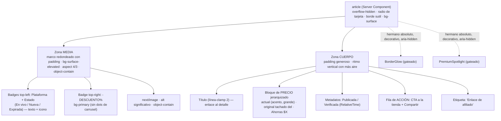

# Documento de Diseño: Rediseño de la tarjeta de oferta (`offer-card.tsx`)

## Objetivo

Rediseñar el componente compartido `components/offers/offer-card.tsx` para capturar el _look_ premium de una referencia visual de e-commerce —imagen grande redondeada como protagonista, barra inferior limpia con más aire, precio en color de acento y una acción moderna— **sin romper ningún requisito** del producto ni sacrificar la honestidad con el visitante.

`OfferCard` es un **Server Component** reutilizado por tres superficies: la grilla de `/ofertas`, el _hero_ de la página de inicio y la sección de destacadas. Por lo tanto el rediseño debe:

- Conservar toda la información obligatoria de la tarjeta (R14.1): plataforma, estado, título, descuento, precio actual, precio original tachado, ahorro, hora de publicación y de última verificación, acción primaria evidente sin _hover_ y acción de compartir.
- Respetar la jerarquía visual exigida (R14.3): **precio actual > descuento > producto > imagen > precio original > metadatos**.
- Mantener intactas las islas cliente actuales y la lógica de datos: `ShareButton`, `RelativeTime`, `PremiumSpotlight` (gateado) y `BorderGlow` (resplandor de borde que sigue el cursor).
- No introducir dependencias nuevas ni cambios en datos, API o contratos de tipos.

Este rediseño es **solo de presentación** (marcado y clases). No cambia el tipo `PublicOffer`, ni `/api/offers`, ni el redirector `/api/click/[offerId]`, ni la lógica pura de `lib/offers/price-visibility`.

---

## Principios rectores heredados

El producto "Ofertas Reales IA" prioriza, en este orden estricto, las siguientes propiedades. Toda decisión de este rediseño se subordina a ese orden:

> **seguridad > funcionalidad > claridad > accesibilidad > rendimiento > confianza > diseño visual > animación decorativa**

Y por encima de la estética está el **rector de honestidad**: el sistema nunca inventa reseñas, existencias, contadores de urgencia, cifras de ventas, ahorros agregados ni funciones inexistentes. El "diseño visual" y la "animación" son las dos prioridades **más bajas**: ninguna mejora estética puede degradar la seguridad, la funcionalidad, la claridad, la accesibilidad ni la confianza.

Requisitos que gobiernan directamente esta tarjeta:

| Requisito | Qué exige (resumen) |
|---|---|
| **R14.1** | Anatomía completa obligatoria de la tarjeta (lista de campos arriba). |
| **R14.2** | Representar los estados "nueva" y "expirada". |
| **R14.3** | Jerarquía visual: precio actual > descuento > producto > imagen > precio original > metadatos. |
| **R14.4 / R14.5** | Efectos premium solo en destacada + primera fila + puntero preciso; desactivados con `pointer: coarse`, `prefers-reduced-motion` o `Save-Data`. |
| **R14.6** | Radio de borde 18–24px, borde sutil, elevación en _hover_ 2–4px, escala máx. 1.01, `object-fit: contain`. |
| **R14.7** | Accesibilidad completa: nombre accesible del botón y `alt` de la imagen. |
| **R11.1** | Botón externo con `rel="sponsored nofollow noopener"`. |
| **R11.2 / R11.5** | El clic se enruta por `/api/click/[offerId]`; nunca un destino del cliente. |
| **R18.1 / R18.2 / R18.5** | Tokens de duración + `cubic-bezier(0.22,1,0.36,1)`; animar **solo** `opacity` y `transform` (aquí también `mask`); respetar `prefers-reduced-motion`. |
| **R21.2** | Etiqueta visible "Enlace de afiliado" cerca del botón externo. |
| **R22.2** | Si `SHOW_AMAZON_PRICES` está apagado, ocultar el precio numérico de Amazon y mostrar el CTA "Consulta el precio actual en Amazon". |
| **R25.3 / R25.5** | Contraste AA, nombres accesibles; nunca transmitir información esencial **solo** por color. |
| **R17.2** | Objetivos táctiles de al menos 44px en móvil. |

---

## Adoptar / Adaptar / Descartar

Análisis honesto de la referencia visual frente a las restricciones del producto. Cada decisión se justifica por su impacto en honestidad, funcionalidad o accesibilidad.

| Elemento de la referencia | Decisión | Justificación |
|---|---|---|
| Imagen grande redondeada como protagonista | **Adoptar** | Da presencia premium al producto sin ocultar información. Se enmarca con padding interno y esquinas redondeadas propias. |
| Precio en color de acento | **Adoptar** | Refuerza la jerarquía R14.3 (precio actual es el elemento más prominente). El color es **secundario** al tamaño/peso, nunca el único indicador. |
| Acción moderna de estilo circular | **Adoptar (estilo)** | Una acción primaria visualmente cuidada y con buena área táctil mejora la claridad. Se adopta el _estilo_, no su mudez (ver "Adaptar"). |
| Barra inferior limpia con más aire | **Adoptar** | Mejora la legibilidad y la sensación premium con mejor espaciado y ritmo vertical. |
| Acción que comunica el destino | **Adaptar** | La acción **no puede ser un icono mudo**: debe nombrar la tienda destino (Amazon / Mercado Libre), conservar `rel="sponsored nofollow noopener"` (R11.1) y la etiqueta visible "Enlace de afiliado" (R21.2). |
| Imagen "protagonista" | **Adaptar** | Se usa marco redondeado grande, pero con `object-fit: contain` (R14.6), **no** `cover`: mostramos el producto completo sin recortes engañosos. |
| Información de la barra inferior | **Adaptar** | Se conserva el aire visual de la referencia **pero** manteniendo toda la info obligatoria (R14.1): plataforma, precio actual, original tachado, descuento %, ahorro, estado y fecha de publicación. |
| Corazón / favorito (_top-right_) | **Descartar** | **Honestidad/funcionalidad:** no hay cuentas de usuario ni lista de deseos, y las ofertas expiran (~30 días). Un corazón sugeriría guardar algo que luego desaparece → engañoso y no funcional. Favoritos quedan **fuera de alcance** (decisión resuelta 4). |
| _Dots_ de carrusel sobre la imagen | **Descartar** | **Honestidad:** cada oferta tiene **una sola** imagen. Mostrar indicadores de galería simularía contenido inexistente. |
| Reducir la tarjeta a solo título + precio | **Descartar** | Perdería información obligatoria (R14.1) y el _disclosure_ de afiliado (R21.2). Incompatible con claridad y confianza. |

---

## Anatomía de la nueva tarjeta

Dos zonas verticales dentro de un contenedor `<article>` con `overflow-hidden` y esquinas redondeadas. Las islas decorativas (`BorderGlow`, `PremiumSpotlight`) permanecen como hermanos absolutos `inset-0` con `rounded-[inherit]`.



Boceto de _wireframe_ (proporciones ilustrativas):

```text
┌────────────────────────────────────────┐  ← article: radio de tarjeta, borde sutil,
│  ┌──────────────────────────────────┐  │     overflow-hidden, bg-surface
│  │ [Amazon] [● En vivo]      [-45%] │  │  ← MEDIA: marco redondeado con padding,
│  │                                  │  │     bg-surface-elevated, aspect 4/3
│  │            (imagen del            │  │     object-contain (producto completo)
│  │          producto, contain)       │  │     badges anclados al marco de la imagen
│  │                                  │  │
│  └──────────────────────────────────┘  │
│                                          │  ← CUERPO: padding generoso, más aire
│  Título del producto en dos líneas como  │
│  máximo …                                │
│                                          │
│  $1,299  ̶$̶2̶,̶3̶5̶0̶                          │  ← precio actual (acento, grande) +
│  Ahorras $1,051                          │     original tachado <del> + ahorro
│                                          │
│  (reloj) Publicada hace 2 h              │  ← metadatos (menos prominentes)
│  Verificada hace 10 min                  │
│                                          │
│  [ Ver en Amazon  ↗ ]   [ Compartir ]    │  ← acción primaria (≥44px) + compartir
│  Enlace de afiliado                      │  ← disclosure R21.2
└────────────────────────────────────────┘
```

### Zona MEDIA

- **Marco de imagen**: contenedor con _padding_ interno (`p-3`/`p-4`), fondo `bg-surface-elevated` y esquinas redondeadas propias (radio grande) para lograr el efecto "imagen protagonista" de la referencia sin ir borde a borde. La imagen se renderiza con `next/image`, `fill`, `object-contain` (R14.6) y `alt` significativo (`offer.image_alt ?? offer.title`). Cuando no hay imagen lista, se usa el _fallback_ `ImageUnavailable` (sin cambios).
- **Badges _top-left_** (anclados al marco de la imagen): **plataforma** ("Amazon" / "Mercado Libre") y **estado**. El estado se comunica siempre con **texto + icono**, nunca solo color (R25.5):
  - _En vivo_: punto `bg-success` + texto "En vivo".
  - _Nueva_: icono `Sparkles` color `primary` + texto "Nueva" (oferta < 60 min, lógica `NEW_WINDOW_MS` sin cambios).
  - _Expirada_: icono `TimerOff` color `warning` + texto "Expirada".
- **Badge _top-right_**: descuento `-{discount_percent}%` sobre `bg-primary`, números tabulares. Segundo en la jerarquía visual (R14.3).
- **Sin _dots_ de carrusel** (decisión Descartar): una sola imagen por oferta.

### Zona CUERPO

Orden de lectura que materializa la jerarquía R14.3, con más aire entre bloques:

1. **Título**: `text-body`, `font-medium`, `line-clamp-2`, enlace a `/ofertas/{slug}` con `hover:text-primary` y foco visible.
2. **Bloque de precio** (el elemento más prominente):
   - **Precio actual**: tamaño grande (`text-h5` o superior), `font-semibold`, `font-tabular`, en **color primario** (`--primary`, decisión resuelta 2).
   - **Precio original**: elemento semántico `<del>`, `text-meta`, `text-muted-foreground`, tabular (R14.1).
   - **Ahorro**: "Ahorras $X" en `text-success` cuando sea calculable.
   - **Precio oculto (R22.2)**: si Amazon + `showAmazonPrices=false`, se muestra el CTA "Consulta el precio actual en Amazon" **en lugar** del número (la función `priceDisplay` ya devuelve `kind: "hidden"`, lo que hace estructuralmente imposible renderizar un precio oculto).
3. **Metadatos**: "Publicada hace X" y "Verificada hace X" vía `RelativeTime` (isla cliente sin cambios), `text-meta`, `text-muted-foreground`. Menos prominentes.
4. **Fila de acción**: CTA explícita "Ver en {plataforma}" (Opción A, decisión resuelta 1) + `ShareButton`.
5. **Etiqueta de afiliado**: "Enlace de afiliado" (R21.2), `text-meta`, `text-muted-foreground`.

---

## Especificación visual con tokens

Todos los valores provienen de tokens semánticos de `app/globals.css`; **no** se introducen colores hexadecimales sueltos (R12.5).

### Contenedor (`<article>`)

| Propiedad | Token / valor | Nota |
|---|---|---|
| Fondo | `bg-surface` | Superficie base de tarjeta. |
| Borde | `border border-border` | Borde sutil (R14.6). |
| Radio | `--radius-card` ≈ 18px (token nuevo/ajustado) | Decisión resuelta 5; cumple R14.6 (18–24px). |
| Recorte | `overflow-hidden` | Necesario para el marco y los _glows_ `rounded-[inherit]`. |
| Layout | `flex flex-col` | Media arriba, cuerpo abajo. |

### Zona media

| Elemento | Token / valor | Nota |
|---|---|---|
| Marco imagen | `bg-surface-elevated`, `rounded-[var(--radius-card)]`, `p-3`/`p-4` | Efecto "protagonista" sin _cover_. |
| Relación de aspecto | `aspect-[4/3]` | Decisión resuelta 3; continuidad con grillas y cero _layout shift_. |
| Ajuste de imagen | `object-contain` | Obligatorio (R14.6); producto completo, sin recortes. |
| Badge plataforma/estado | `bg-background/85` + `backdrop-blur-sm`, `rounded-full`, `text-meta` | Legible sobre cualquier imagen. |
| Badge descuento | `bg-primary text-primary-foreground`, `font-semibold`, `font-tabular`, `rounded-full` | Color de marca; el "%" es texto, no solo color. |
| Icono estado en vivo | punto `bg-success` | Acompañado de texto "En vivo". |
| Icono nueva | `Sparkles` `text-primary` | Acompañado de texto "Nueva". |
| Icono expirada | `TimerOff` `text-warning` | Acompañado de texto "Expirada". |

### Cuerpo

| Elemento | Token / valor | Nota |
|---|---|---|
| Título | `text-body`, `font-medium`, `text-foreground`, `line-clamp-2` | `hover:text-primary`, foco visible. |
| Precio actual | `text-h5`+, `font-semibold`, `font-tabular`, `text-primary` | Color primario (decisión resuelta 2); AA en claro y oscuro. |
| Precio original | `<del>`, `text-meta`, `text-muted-foreground`, `font-tabular` | Semántica de tachado. |
| Ahorro | `text-meta`, `font-medium`, `text-success` | "Ahorras $X". |
| CTA precio oculto | `text-primary`, `font-semibold` | Reemplaza el número en Amazon oculto. |
| Metadatos | `text-meta`, `text-muted-foreground`, icono `Clock` | `aria-hidden` en iconos. |
| CTA tienda | `bg-primary text-primary-foreground`, `rounded-[var(--radius-control)]`, `font-semibold`, `min-h-[44px]` | Transición solo de color en _hover_. |
| Botón compartir | `border border-border`, `bg-surface`, `rounded-[var(--radius-control)]`, `min-h-[44px]` | Subir a ≥44px (hoy `py-2`, ~36px). |
| Etiqueta afiliado | `text-meta`, `text-muted-foreground` | "Enlace de afiliado". |

**Tipografía / números**: precios, descuento y ahorro usan `.font-tabular` (cifras tabulares, R12.6) para evitar saltos de ancho. La escala fluida (`--step-*`) garantiza legibilidad en Android de gama baja.

**Contraste (R25.3)**: `--primary` está calibrado para AA como texto pequeño en ambos temas (claro `199 89% 30%`, oscuro `199 89% 52%`). El precio usa `--primary` (decisión resuelta 2), por lo que **no** se introduce ningún token de acento nuevo ni requiere calibración adicional.

> **Nota de radio (reconciliación R14.6) — resuelta.** El token actual `--radius` es 13px y `--radius-lg` es 16px; **ninguno** cae en el rango 18–24px que pide R14.6. Resolución (decisión resuelta 5): se **introduce/ajusta** un token de tarjeta `--radius-card` ≈ 18px y se aplica al contenedor `<article>` y al marco de imagen. Es un cambio de un único valor de token (no una dependencia ni un cambio de datos). Los hermanos decorativos `BorderGlow` y `PremiumSpotlight`, posicionados `inset-0` con `rounded-[inherit]`, **heredan automáticamente** el nuevo radio sin cambios.

---

## Estados

| Estado | Disparador | Tratamiento visual |
|---|---|---|
| **Default** | Oferta activa con precio visible | Anatomía completa; precio actual prominente en acento; badge "En vivo". |
| **Hover** (solo `hover:hover`) | Puntero sobre la tarjeta | Elevación `translateY(-3px)` + `scale(≤1.01)` (R14.6), transición `--duration-fast` + `--ease-emphasized`. El título pasa a `text-primary`. Desactivado en táctil y con `prefers-reduced-motion`. |
| **Nueva** | `published_at` < 60 min y no expirada | Badge "Nueva" con `Sparkles` `text-primary` en _top-left_ (sustituye a "En vivo"). |
| **En vivo** | Activa, no nueva | Punto `bg-success` + texto "En vivo". |
| **Expirada** | `status === "expired"` | `opacity-80` en la tarjeta, badge "Expirada" con `TimerOff` `text-warning`. La acción y la info se conservan (la página de detalle gestiona el aviso "podría haber terminado"). |
| **Precio oculto** | Amazon + `showAmazonPrices=false` (R22.2) | En lugar del número, CTA "Consulta el precio actual en Amazon" en `text-primary`; no se muestra `<del>` ni "Ahorras". |
| **Sin imagen** | `image_status !== "ready"` o `image_url === null` | Marco con `ImageUnavailable` (componente existente), `object-contain` no aplica. |
| **Destacada + 1ª fila + puntero fino** | `is_featured && isFirstRow` y gate abierto | `PremiumSpotlight` activo (reflejo que sigue el cursor). Decorativo, `aria-hidden`, _click-through_. |

Todos los estados se comunican con **texto + icono**, nunca solo con color (R25.5).

---

## Movimiento

Cumple R18.1, R18.2, R18.5 sin cambios en el contrato de animación ya establecido:

- **Solo se anima `opacity`, `transform` y `mask`** (R18.2). El _hover_ de la tarjeta anima `transform` (translate + scale); los _glows_ animan `opacity` y un ángulo de `mask`. Nunca se animan `width/height/top/left`.
- **Tokens de tiempo y curva**: `--duration-fast` (190ms) para el _hover_ de la tarjeta; `--duration-normal` (280ms) para la opacidad de los _glows_; curva `--ease-emphasized` = `cubic-bezier(0.22, 1, 0.36, 1)`.
- **`prefers-reduced-motion`** (R18.5): el `<article>` lleva `motion-reduce:transition-none`; además `globals.css` colapsa globalmente transiciones/animaciones a ~0ms conservando los estados finales y toda la funcionalidad. `BorderGlow` y `PremiumSpotlight` se autodesactivan (no montan _listeners_).
- **Coexistencia con `BorderGlow`**: isla cliente que sigue al cursor y enciende solo el arco del borde más cercano, usando una `conic-gradient` como máscara y el color único `--primary`. Sigue el mismo _gate_ que `PremiumSpotlight` (`pointer: fine` + sin _reduced-motion_ + sin `Save-Data`) y throttling con `requestAnimationFrame` (R18.3). Como es un hermano `inset-0` con `rounded-[inherit]`, **hereda automáticamente el nuevo radio** del contenedor: no requiere cambios al cambiar el radio.
- **Coexistencia con `PremiumSpotlight`**: idéntico patrón de _gate_ e inserción; solo se enciende en destacada + primera fila + puntero fino (R14.4/R14.5). Decorativo, `aria-hidden`, `pointer-events-none`.

> Importante: el rediseño **no** añade nuevas animaciones JS. El marco de imagen y la barra inferior son estáticos; el único movimiento nuevo es el _hover_ CSS de elevación/escala que ya existía. Mantener `overflow-hidden` en el `<article>` es necesario para que el marco redondeado y los _glows_ se recorten correctamente.

---

## Accesibilidad

Cumple R14.7 y R25:

- **Nombre accesible de la acción** (R14.7, R25.3): el enlace a la tienda mantiene `aria-label` que nombra plataforma + título, p. ej. `aria-label="Ver oferta en Amazon: {título}"`. Con la **Opción A** (decisión resuelta 1), el texto visible "Ver en {plataforma}" ya nombra el destino y el `aria-label` lo refuerza con el título.
- **`alt` de imagen** (R14.7): `offer.image_alt ?? offer.title`. Iconos decorativos con `aria-hidden="true"`.
- **Color nunca como único indicador** (R25.5): estado (texto + icono), descuento (texto "-45%"), precio (tamaño/peso además del color). El acento del precio es refuerzo, no el único portador de significado.
- **Foco visible** (R25.1): título y botones con `focus-visible:ring-2 focus-visible:ring-focus-ring`; el `:focus-visible` global aplica `outline` de 2px.
- **Objetivos táctiles ≥44px** (R17.2): CTA de tienda y `ShareButton` con `min-h-[44px]`. **Mejora honesta:** el `ShareButton` actual (`py-2`, ~36px) queda por debajo de 44px; el rediseño lo eleva a ≥44px.
- **Contraste AA** en claro y oscuro (R25.3): se usan tokens ya calibrados; cualquier acento nuevo debe verificarse a ≥4.5:1.
- **Estructura semántica**: `<article aria-labelledby>` referenciando el `id` del título; precio original en `<del>`; metadatos en `<dl>`; tiempos en `<time dateTime>` (vía `RelativeTime`).
- **Elementos decorativos** (`BorderGlow`, `PremiumSpotlight`) marcados `aria-hidden` y `pointer-events-none`.

---

## Impacto en código

**Único archivo a modificar:** `components/offers/offer-card.tsx` (marcado y clases Tailwind/tokens). Cambios de presentación, sin tocar lógica de datos.

Qué cambia (ilustrativo, no es una edición todavía):

- Reestructurar la **zona media**: envolver la imagen en un marco redondeado con _padding_ (`bg-surface-elevated`, `rounded-[var(--radius-card)]`) y anclar los badges a ese marco.
- Reescalar el **bloque de precio**: precio actual más grande y en color primario (`--primary`); mantener `<del>` y "Ahorras".
- Reestilizar la **fila de acción** con más aire y `min-h-[44px]`; CTA "Ver en {plataforma}" (**Opción A**, decisión resuelta 1) + `ShareButton`.
- Ajustar **radio** del contenedor al token `--radius-card` ≈ 18px (decisión resuelta 5); los _glows_ `inset-0 rounded-[inherit]` heredan el nuevo radio sin cambios.
- Subir el `ShareButton` a ≥44px (ajuste de clases en `share-button.tsx`, opcionalmente, o vía prop `className`).

Qué **no** cambia (se preserva tal cual):

- Islas cliente: `ShareButton`, `RelativeTime`, `PremiumSpotlight`, `BorderGlow` (se mantienen como hermanos `inset-0`, `rounded-[inherit]`; heredan el nuevo radio sin cambios).
- Threading del _flag_ `showAmazonPrices` desde el servidor (R22.2) y la lógica pura `priceDisplay` (sin tocar `lib/offers/price-visibility`).
- Enrutado del clic por `/api/click/[offerId]` y `rel="sponsored nofollow noopener"` (R11.1, R11.2/R11.5).
- Etiqueta "Enlace de afiliado" (R21.2).
- Tipo `PublicOffer`, `/api/offers`, `next/image`, `next/font`.
- El `<article>` sigue siendo Server Component; la interactividad sigue confinada a las islas cliente.

**Coexistencia con los _glows_:** como `BorderGlow` y `PremiumSpotlight` se posicionan con `inset-0` y `rounded-[inherit]` sobre el `<article>`, trazan el borde **exterior** de la tarjeta. El nuevo marco de imagen interior (con su propio radio y _padding_) no interfiere: el _glow_ sigue el borde de la tarjeta, no el del marco. Mantener `overflow-hidden` evita que el _glow_ o el marco se desborden.

---

## Fuera de alcance

- **Sin nuevas dependencias** (se usan `lucide-react`, `next/image`, Tailwind y tokens ya presentes).
- **Sin cambios de datos/API/tipos**: ni `PublicOffer`, ni `/api/offers`, ni `/api/click`, ni esquema de base de datos, ni `price-visibility`.
- **Sin favoritos / lista de deseos** (decisión resuelta 4: fuera de alcance).
- **Sin carrusel ni _dots_** en la tarjeta.
- **Sin cambios en la página de detalle** `/ofertas/[slug]`, ni en `opengraph-image`, ni en los filtros/orden.
- **Sin nuevas animaciones JS** ni efectos WebGL.
- **Sin alterar el _gate_ de efectos premium** ni la lógica de `PremiumSpotlight`/`BorderGlow` (solo coexistencia visual).
- No se modifica la lógica de "nueva" (`NEW_WINDOW_MS`) ni de expiración.

---

## Decisiones resueltas

El usuario aprobó el diseño y fijó **todas** las decisiones recomendadas. Quedan resueltas así y se propagan a lo largo de este documento y a los requisitos derivados:

1. **Acción primaria → Opción A.** CTA explícita "Ver en {Amazon / Mercado Libre}" reestilizada premium + botón "Compartir". **No** se usa un botón circular mudo. Máxima claridad y transparencia del destino: el texto visible ya nombra la tienda, además del `aria-label` con plataforma + título.

2. **Color del precio → `--primary`.** Cero tokens de acento nuevos; contraste AA ya calibrado en claro y oscuro. Se descarta el ámbar dedicado (`--price-accent`) y queda prohibido reutilizar `--warning` para el precio (colisión semántica con advertencia/expiración).

3. **Relación de aspecto de la imagen → 4/3.** Continuidad con las grillas existentes y cero _layout shift_. Con `object-contain` el producto se muestra completo.

4. **Favoritos → fuera de alcance.** Sin cuentas ni _wishlist_ y con ofertas que expiran, un corazón sería engañoso. No se incluye en este rediseño ni se diseña aquí una alternativa.

5. **Radio de la tarjeta → token `--radius-card` ≈ 18px.** Se introduce/ajusta un token de tarjeta a ~18px (cambio de un único valor de token) aplicado al `<article>` y al marco de imagen, cumpliendo R14.6 (18–24px). Los _glows_ `inset-0 rounded-[inherit]` heredan el radio sin cambios.

---

> **Estado del flujo:** con el diseño aprobado y las decisiones resueltas, el _spec_ `rediseno-card-oferta` avanza a la **fase de Requisitos**. Los requisitos se derivan de este diseño (sin introducir alcance nuevo) en `requirements.md`. Tras tu revisión de los requisitos, el flujo continuará con el **plan de tareas**.
